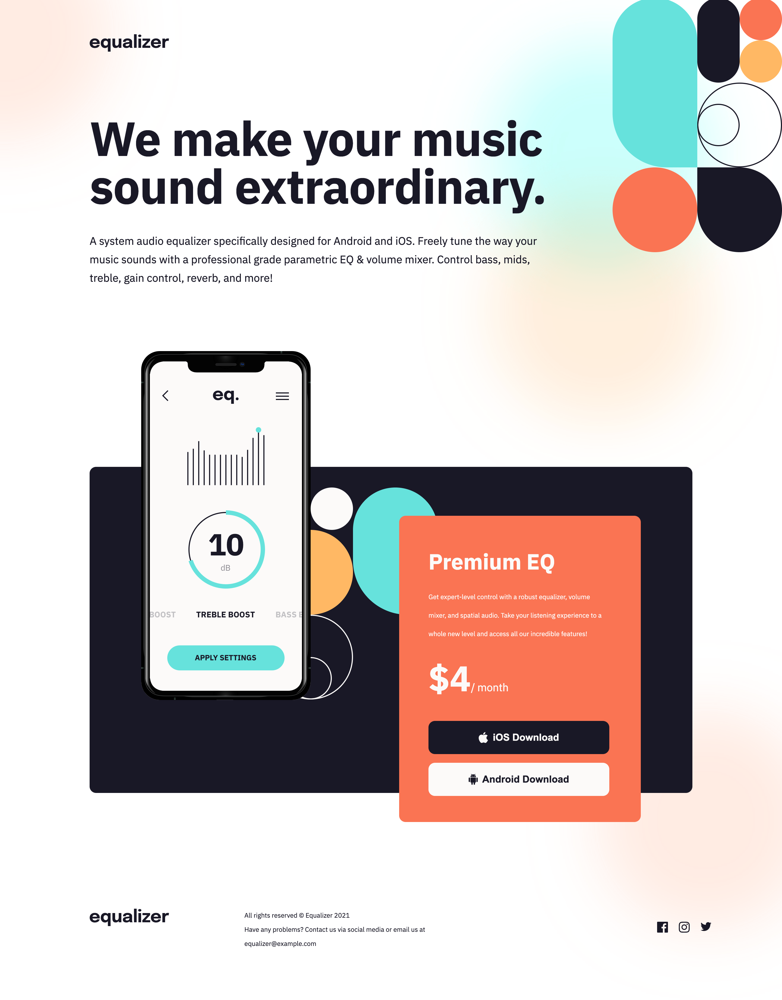
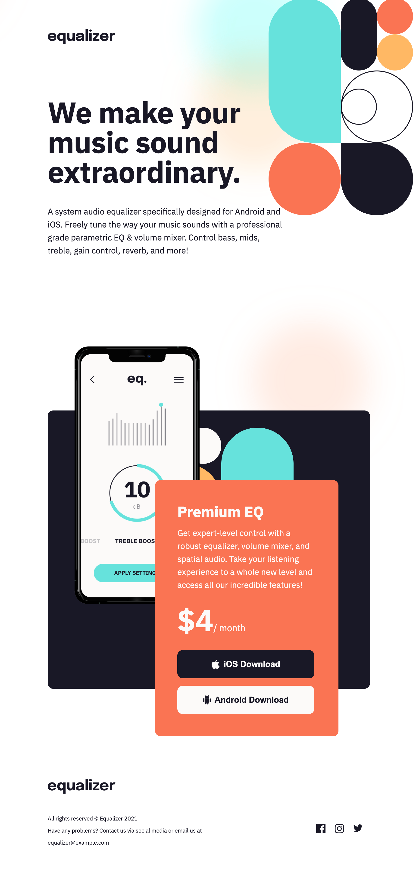
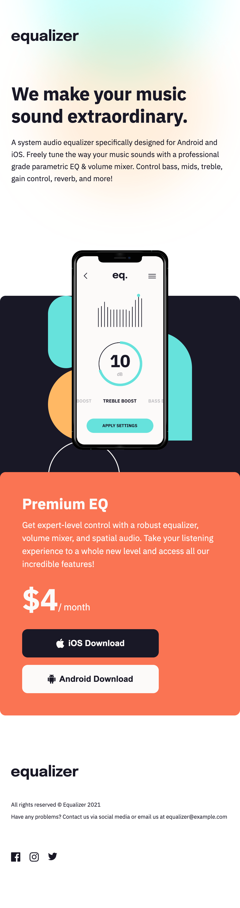

# Frontend Mentor -  Equalizer landing page sulotion

This is a solution to the [Equalizer landing page challenge on Frontend Mentor](https://www.frontendmentor.io/challenges/equalizer-landing-page-7VJ4gp3DE).

## Table of contents

- [Overview](#overview)
  - [The challenge](#the-challenge)
  - [Screenshot](#screenshot)
  - [Links](#links)
- [My process](#my-process)
  - [Built with](#built-with)
- [Author](#author)

## Overview

### The challenge

Users should be able to:

- View the optimal layout depending on their device's screen size
- See hover states for interactive elements

### Screenshot

### Links

- Solution URL: [Click here](https://www.frontendmentor.io/solutions/equalizer-landing-page-g01SQI3VtD)
- Live Site URL: [Click here](https://cerulean-arithmetic-ca136f.netlify.app/)

### Built with

- Semantic HTML5 markup
- CSS with Sass
- CSS Grid
- Flexbox

## Author

- Website - [Luke Lai](https://lukelai.tech/)
- Frontend Mentor - [@SimpleLuke](https://www.frontendmentor.io/profile/SimpleLuke)
- Twitter - [@LukeLaiDev](https://www.twitter.com/LukeLaiDev)

